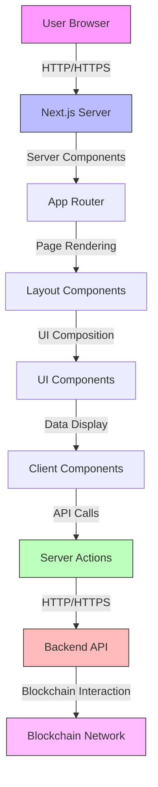
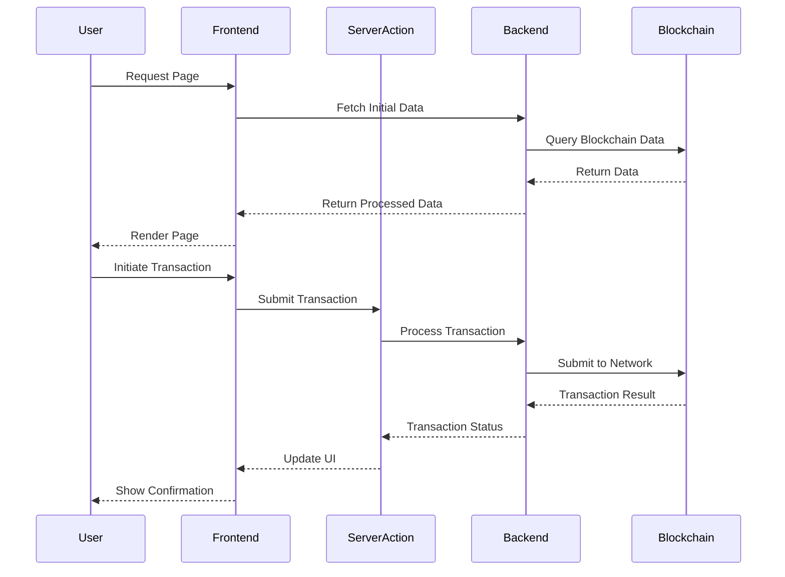

# Architecture for COS30049 Blockchain Frontend

## Technical Summary

This architecture defines a modern, responsive, and user-friendly frontend application for interacting with blockchain services. The system is built using Next.js with the App Router, providing server-side rendering capabilities, optimized client-side navigation, and a component-based architecture. The application connects to backend blockchain services to manage wallets, transactions, and asset visualization.

## Technology Table

| Technology     | Description                                                     |
| -------------- | --------------------------------------------------------------- |
| Next.js 15     | React framework with App Router for server and client rendering |
| React 19       | UI library for component-based development                      |
| TypeScript     | Strongly-typed JavaScript for improved developer experience     |
| Tailwind CSS   | Utility-first CSS framework for responsive design               |
| Radix UI       | Unstyled, accessible UI components                              |
| Recharts       | Composable charting library for data visualization              |
| Viem           | TypeScript interface for Ethereum                               |
| Framer Motion  | Animation library for React                                     |
| React Flow     | Library for building node-based UIs                             |
| Tanstack Table | Headless UI for building powerful tables                        |
| Embla Carousel | Lightweight carousel component                                  |

## Architecture Diagrams





## Project Structure

```
/
├── /src
│   ├── /app                 # Next.js App Router pages and layouts
│   │   ├── /dashboard       # Dashboard pages
│   │   ├── /wallet          # Wallet management pages
│   │   ├── /transactions    # Transaction pages
│   │   ├── /assets          # Asset visualization pages
│   │   └── /auth            # Authentication pages
│   ├── /components          # Reusable UI components
│   │   ├── /ui              # Base UI components
│   │   ├── /charts          # Data visualization components
│   │   ├── /forms           # Form components
│   │   └── /layouts         # Layout components
│   ├── /lib                 # Utility functions and types
│   │   ├── /api             # API client and types
│   │   ├── /utils           # Helper functions
│   │   └── /hooks           # Custom React hooks
│   └── /actions             # Server actions for data fetching
│       ├── /wallet          # Wallet-related actions
│       ├── /transaction     # Transaction-related actions
│       └── /asset           # Asset-related actions
├── /public                  # Static assets
├── /docs                    # Documentation
└── /node_modules           # Dependencies
```
